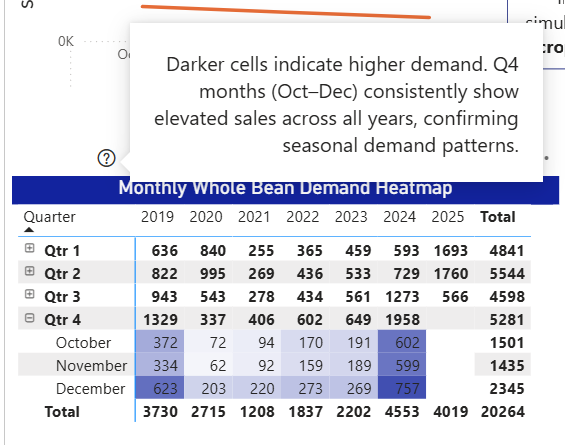
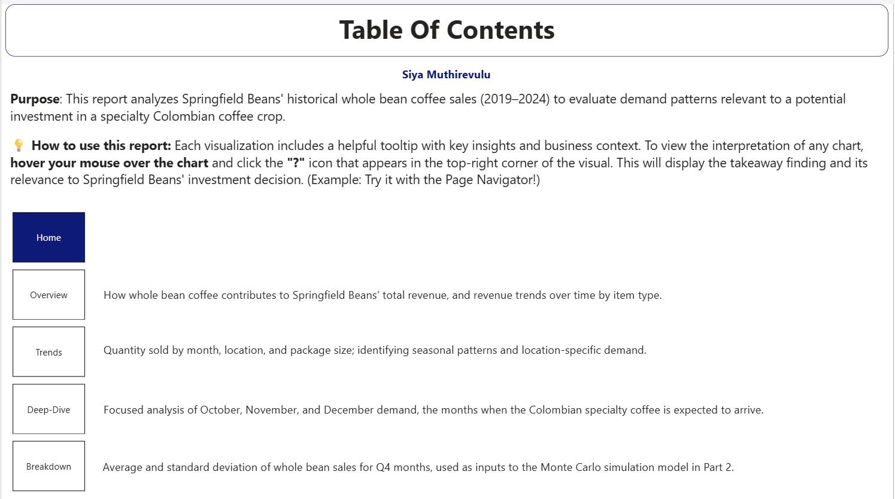
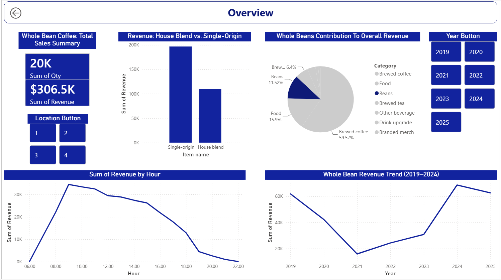
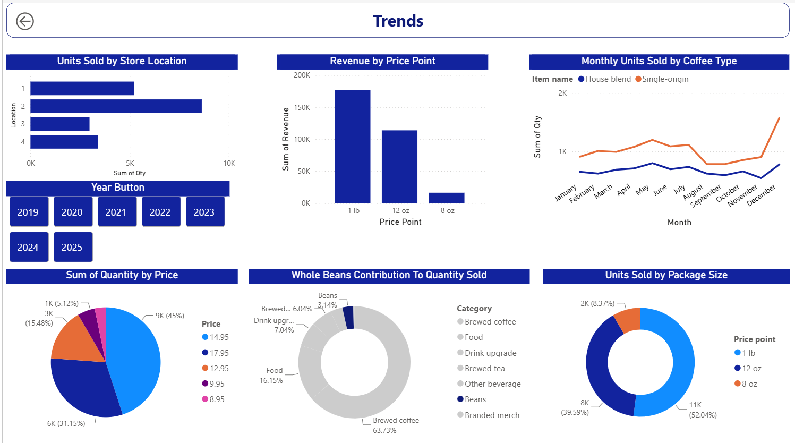
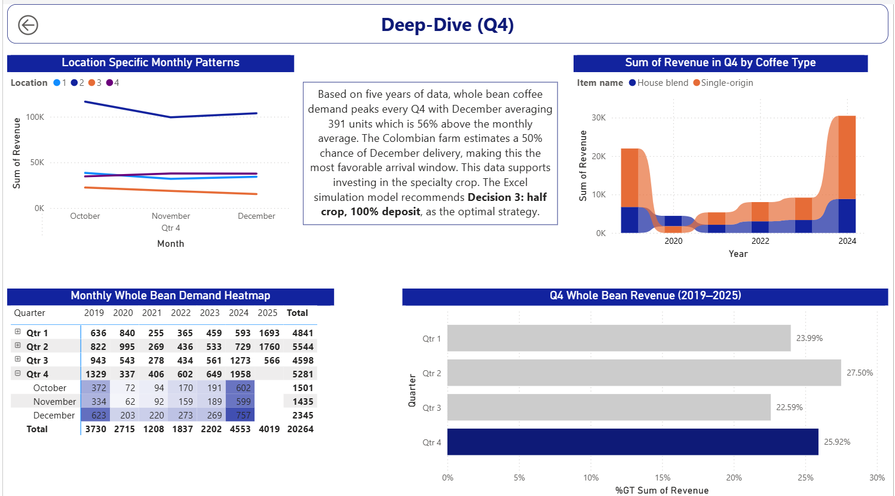
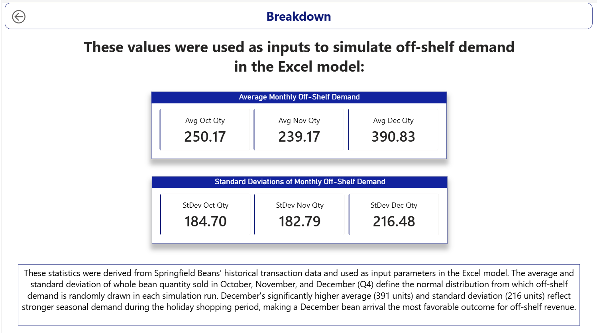

[Download the Excel model (.xlsm)](Company_Analysis_EXCEL.xlsm) | [Download the Power BI report (.pbix)](Company_Analysis_PBI.pbix)
---

## 1. Business Problem

Springfield Beans, a gourmet coffee shop, was approached about purchasing a new crop of specialty Colombian coffee beans, either the full 1-acre harvest or half of it, and had to decide how to structure pre-orders (no deposit, 50% deposit, or 100% deposit) before committing. Both the harvest yield and timing were uncertain, and customer demand depended heavily on how much deposit was required. To tackle this, I split this into two parts:

1. **Explore historical sales data in Power BI** to understand demand patterns for whole bean coffee; the closest proxy available for how this new specialty crop might sell.
2. **Build a Monte Carlo simulation in Excel** that combined crop yield uncertainty, customer demand uncertainty, and the six possible purchase/deposit decisions into a risk-based recommendation, using the Power BI findings as direct inputs to the simulation.

## 2. Part 1 — Power BI: Exploratory & Explanatory Analysis

The report is structured as a 5-page navigable dashboard: **Home → Overview → Trends → Deep-Dive → Breakdown**, with a page-navigator button and hover tooltips on each visual explaining its takeaway and business relevance, built so the report can stand on its own as a presentation, without someone there to narrate it live.

**Visual types used across the report:** line charts, pie and donut charts, clustered column and bar charts, a ribbon chart, a pivot table, KPI cards, slicers, and interactive action buttons for navigation.

**Key findings driving the investment decision** (pulled directly from the report):

- Whole bean coffee demand is strongly seasonal, **peaking every Q4**, with **December averaging 391 units — 56% above the monthly average**.
- The Colombian farm estimated a **50% chance of December delivery** (vs. 20% October, 30% November) — meaning the most likely arrival window lines up with the strongest demand period.
- Month-specific average and standard deviation of whole bean sales for October, November, and December were calculated directly in Power BI (via grouped queries in Power Query) and fed as the actual input parameters for the off-shelf demand random variables in the Excel simulation — a direct hand-off between the two tools rather than two disconnected analyses.

## 3. Part 2 — Excel: Monte Carlo Simulation

### Decision Framework

Six decisions were modeled, crossing two choices:

| | 0% Deposit | 50% Deposit | 100% Deposit |
|---|---|---|---|
| **50% of crop** | Decision 1 | Decision 2 | Decision 3 |
| **100% of crop** | Decision 4 | Decision 5 | Decision 6 |

### Random Variables

- **Crop yield**: Normal distribution, mean 800 lbs, standard deviation 90 lbs, via `NORM.INV(RAND(), mean, stdev)`.
- **Orders placed**: Binomial distribution over 750 potential customers, using `BINOM.INV`, with the probability of placing an order depending on deposit level (customers are more willing to place an order with no deposit required — 90% vs. 50% at full deposit).
- **Orders completed**: A second binomial draw, where the probability of actually completing (picking up) a placed order *increases* with deposit level (70% at no deposit vs. ~100% at full deposit) — modeling the real trade-off between attracting orders and having customers actually follow through.
- **Harvest-ready month**: A discrete random variable (October/November/December) drawn via a cumulative-probability lookup against the farm's stated delivery odds.
- **Off-shelf demand**: Normal distribution, with mean and standard deviation pulled directly from the Power BI Part 1 analysis, conditioned on whichever month the harvest actually lands in that simulation run.

### Simulation Engine

The model uses Excel's **Data Table** feature to run **1,000 iterations across all 6 decisions simultaneously**, recalculating every random variable each time. Results are summarized on a separate sheet with mean, standard deviation, and the 5th/25th/50th/75th/95th percentiles of profit for every decision — plus `P(Profit > $0)`, giving a direct read on how *risky*, not just how *profitable*, each option is.

A **"FROZEN" toggle** lets a user switch the whole model to deterministic mode (every random variable snaps to its expected value) for sanity-checking the logic, without losing the ability to switch back to full simulation.

## 4. Results

Simulated profit summary (before accounting for off-shelf sales), one representative run of 1,000 iterations:

| Decision | Mean Profit | Std. Dev. | P(Profit > $0) |
|---|---|---|---|
| 1 — 50% crop, 0% deposit | $906.60 | ~$0 | 100% |
| 2 — 50% crop, 50% deposit | $974.92 | $21.85 | 100% |
| 3 — 50% crop, 100% deposit | $905.33 | $16.52 | 100% |
| 4 — 100% crop, 0% deposit | -$1,085.68 | $166.19 | 0% |
| 5 — 100% crop, 50% deposit | -$462.45 | $164.61 | 0.4% |
| 6 — 100% crop, 100% deposit | -$2,345.61 | $186.45 | 0% |

Once off-shelf sales of leftover beans are added back in, the picture shifts — the full-crop decisions (4–6) post much higher *mean* profit (roughly $1,600–$1,900), since off-shelf sales absorb a lot of the excess inventory. But the half-crop decisions still carry dramatically lower risk (P(Profit > $0) of 100% vs. near-zero without the off-shelf boost) — a classic **risk vs. expected-value trade-off**.

**Note on these numbers:** because this is a live Monte Carlo simulation (every random variable recalculates on open), the exact figures shift slightly each time the workbook runs. The table above reflects one saved snapshot where the pattern across decisions is the meaningful, stable part, not the specific dollar figures.

## 5. Recommendation

From the report: *"This data supports investing in the specialty crop. The Excel simulation model recommends **Decision 3: half crop, 100% deposit**, as the optimal strategy."*

Decision 3 doesn't post the highest expected profit in every scenario, but it guarantees a positive outcome and the lowest variance of any option, while the highest-expected-value decisions (4–6, without off-shelf sales) carry real risk of a loss. Framing the recommendation around risk tolerance, not just maximizing the average outcome, is the core judgment call of the analysis. 

## 6. Skills Demonstrated

- **Power BI**: Power Query data transformation, `RELATED()` calculated columns, `Group By` aggregation for statistical inputs, custom tooltips, multi-page interactive report design
- **Excel**: Monte Carlo simulation via Data Tables, `NORM.INV`, `BINOM.INV`, cumulative-probability lookups for discrete random variables, `PERCENTILE.INC` risk analysis, dynamic model toggles
- **Cross-tool integration**: using statistical outputs from one tool (Power BI) as calibrated inputs to a second tool's random variables (Excel) rather than treating the two analyses as siloed deliverables
- **Decision analysis under uncertainty**: framing a recommendation around risk (probability of loss, variance) rather than expected value alone

---

*K303 Capstone Case, Kelley School of Business, Indiana University.*
